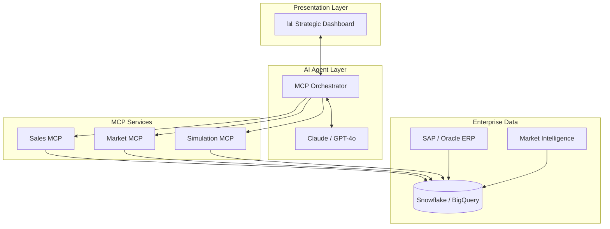

```mermaid
flowchart TB

subgraph UI["Presentation Layer"]
    Dashboard["📊 Strategic Dashboard"]
end

subgraph Agent["AI Agent Layer"]
    Orchestrator["MCP Orchestrator"]
    LLM["Claude / GPT-4o"]
end

subgraph MCP["MCP Services"]
    Sales["Sales MCP"]
    Market["Market MCP"]
    Revenue["Simulation MCP"]
end

subgraph Data["Enterprise Data"]
    Warehouse[("Snowflake / BigQuery")]
    ERP["SAP / Oracle ERP"]
    MarketData["Market Intelligence"]
end

Dashboard <--> Orchestrator
Orchestrator <--> LLM

Orchestrator --> Sales
Orchestrator --> Market
Orchestrator --> Revenue

Sales --> Warehouse
Market --> Warehouse
Revenue --> Warehouse

ERP --> Warehouse
MarketData --> Warehouse
```
