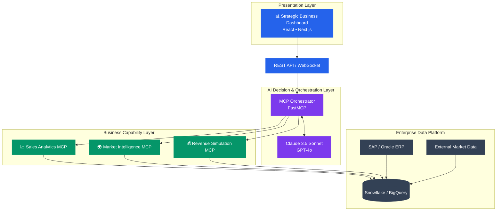

```mermaid
flowchart TB

subgraph UI["Presentation Layer"]
    Dashboard["📊 Strategic Business Dashboard<br/>React • Next.js"]
end

Dashboard --> API["REST API / WebSocket"]

API --> Orchestrator

subgraph AI["AI Decision & Orchestration Layer"]
    Orchestrator["MCP Orchestrator<br/>FastMCP"]
    LLM["Claude 3.5 Sonnet<br/>GPT-4o"]
end

Orchestrator <--> LLM

subgraph MCP["Business Capability Layer"]
    Sales["📈 Sales Analytics MCP"]
    Market["🌍 Market Intelligence MCP"]
    Revenue["💰 Revenue Simulation MCP"]
end

Orchestrator --> Sales
Orchestrator --> Market
Orchestrator --> Revenue

subgraph Data["Enterprise Data Platform"]
    ERP["SAP / Oracle ERP"]
    Warehouse[("Snowflake / BigQuery")]
    External["External Market Data"]
end

Sales --> Warehouse
Market --> Warehouse
Revenue --> Warehouse

ERP --> Warehouse
External --> Warehouse

classDef ui fill:#2563eb,color:#fff,stroke:#2563eb
classDef ai fill:#7c3aed,color:#fff,stroke:#7c3aed
classDef mcp fill:#059669,color:#fff,stroke:#059669
classDef data fill:#334155,color:#fff,stroke:#334155

class Dashboard,API ui
class Orchestrator,LLM ai
class Sales,Market,Revenue mcp
class ERP,Warehouse,External data
```
