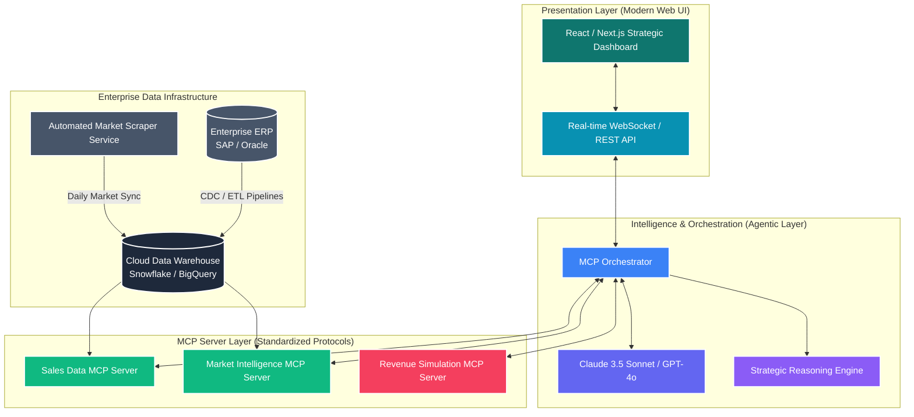

```mermaid
graph TD

subgraph "Presentation Layer (Modern Web UI)"
    UI["React / Next.js Strategic Dashboard"]
    WS["Real-time WebSocket / REST API"]
end

subgraph "Intelligence & Orchestration (Agentic Layer)"
    LLM["Claude 3.5 Sonnet / GPT-4o"]
    Agent["MCP Orchestrator"]
    Reasoning["Strategic Reasoning Engine"]
end

subgraph "MCP Server Layer (Standardized Protocols)"
    SalesMCP["Sales Data MCP Server"]
    MarketMCP["Market Intelligence MCP Server"]
    SimMCP["Revenue Simulation MCP Server"]
end

subgraph "Enterprise Data Infrastructure"
    ERP[("Enterprise ERP<br/>SAP / Oracle")]
    DW[("Cloud Data Warehouse<br/>Snowflake / BigQuery")]
    Scraper["Automated Market Scraper Service"]
end

%% Data Flow
ERP -->|"CDC / ETL Pipelines"| DW
Scraper -->|"Daily Market Sync"| DW

DW --> SalesMCP
DW --> MarketMCP

UI <--> WS
WS <--> Agent

Agent <--> LLM
Agent --> Reasoning

Agent <--> SalesMCP
Agent <--> MarketMCP
Agent <--> SimMCP

%% Styling
style LLM fill:#6366f1,stroke:#ffffff,stroke-width:2px,color:#ffffff
style Agent fill:#3b82f6,stroke:#ffffff,stroke-width:2px,color:#ffffff
style Reasoning fill:#8b5cf6,stroke:#ffffff,stroke-width:2px,color:#ffffff

style SalesMCP fill:#10b981,stroke:#ffffff,stroke-width:2px,color:#ffffff
style MarketMCP fill:#10b981,stroke:#ffffff,stroke-width:2px,color:#ffffff
style SimMCP fill:#f43f5e,stroke:#ffffff,stroke-width:2px,color:#ffffff

style ERP fill:#475569,stroke:#ffffff,stroke-width:2px,color:#ffffff
style DW fill:#1e293b,stroke:#ffffff,stroke-width:2px,color:#ffffff
style Scraper fill:#475569,stroke:#ffffff,stroke-width:2px,color:#ffffff

style UI fill:#0f766e,stroke:#ffffff,stroke-width:2px,color:#ffffff
style WS fill:#0891b2,stroke:#ffffff,stroke-width:2px,color:#ffffff
```
