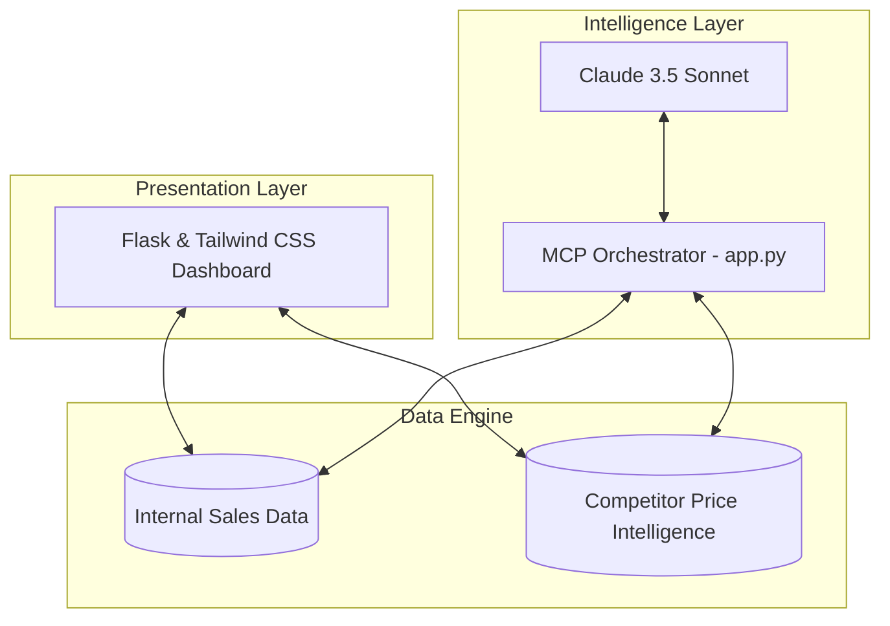

# 🚀 FMCG Insight Lens: AI-Powered Performance Orchestrator

**FMCG Insight Lens** is an enterprise-grade strategic dashboard and AI agent ecosystem designed for the Fast-Moving Consumer Goods (FMCG) industry. By leveraging the **Model Context Protocol (MCP)**, it bridges the gap between local operational data (ERP/CSVs) and Large Language Models (LLMs), enabling autonomous pricing strategies and inventory optimization.

---

## 🏗️ System Architecture

The project follows a modern **Agentic Architecture** where the LLM acts as the brain, Python acts as the engine, and the Web UI acts as the cockpit.



---

## ✨ Key Features

*   **Autonomous Strategic Analysis:** AI-driven insights that classify SKUs into strategic categories (e.g., Inventory Shortage, Revenue Leakage, or Optimized).
*   **Market Pulse Benchmarking:** Real-time comparison between internal unit prices and competitor averages.
*   **Inventory Health Tracking:** Dynamic **Days of Inventory (DOI)** calculation with visual alerts for stock-out risks.
*   **MCP Integration:** A dedicated Model Context Protocol server that allows Claude Desktop to "talk" to your local data without manual uploads.
*   **Revenue Impact Projection:** Every AI recommendation includes a projected P&L impact (e.g., "+12% Gross Profit").

---

## 🛠️ Technology Stack

| Component | Technology |
| :--- | :--- |
| **Language** | Python 3.12+ |
| **Protocol** | Model Context Protocol (MCP) |
| **LLM** | Claude 3.5 Sonnet |
| **Web Framework** | Flask |
| **Styling** | Tailwind CSS & FontAwesome |
| **Data Analysis** | Pandas & NumPy |

---

## 🚀 Getting Started

### 1. Installation
Clone the repository and install dependencies:
```bash
# Create a virtual environment
python3.12 -m venv .venv
source .venv/bin/activate

# Install requirements
pip install -r requirements.txt
```

### 2. Run the Strategic Dashboard
The dashboard provides a human-centric view of your portfolio performance.
```bash
python app_web.py
```
Open **`http://127.0.0.1:5001`** in your browser.

---

## 🔌 Connecting to Claude Desktop (MCP)

This is the "Secret Sauce" of the project. By connecting `app.py` to Claude Desktop via MCP, you can chat with your data securely.

### Configuration
Update your `claude_desktop_config.json`:
- **macOS:** `~/Library/Application Support/Claude/claude_desktop_config.json`
- **Windows:** `%APPDATA%\Roaming\Claude\claude_desktop_config.json`

Add the server:
```json
{
  "mcpServers": {
    "fmcg_insights": {
      "command": "/Users/YOUR_USER/fmcg_project/.venv/bin/python",
      "args": [
        "/Users/YOUR_USER/fmcg_project/app.py"
      ]
    }
  }
}
```
*Now, you can ask Claude: "Which of my shampoo SKUs are at risk of stock-out?"*

---

## 📊 Business Logic & ROI

The system doesn't just show data; it provides **Strategic Recommendations**:

1.  **Inventory Shortage:** Detects low DOI and suggests "Price Skimming" to maximize margin before stock-out.
2.  **Competitive Gap:** Detects high price variance vs. market and suggests "Bundle Deals" to recover volume.
3.  **Revenue Leakage:** Identifies SKUs where internal prices are too low compared to market leaders, suggesting incremental increases.

---

## 🛡️ Security & Privacy
*   **Local First:** Your sensitive cost and sales data stay on your local machine.
*   **Data Masking:** Only the necessary analytical results are shared with the LLM context, keeping the raw database secure.

---

## 🗺️ Future Roadmap
- [ ] Integration with live SAP/Oracle ERP APIs.
- [ ] Multi-currency support for global markets.
- [ ] Predictive Demand Sensing using external weather and holiday data.
┌──────────────────────────────────────────────────────────────────────┐
│                      Strategic Business Dashboard                    │
│                     React • Next.js • Real-time UI                  │
└───────────────────────────────┬──────────────────────────────────────┘
                                │
                       REST API / WebSocket
                                │
                                ▼
┌──────────────────────────────────────────────────────────────────────┐
│                    AI Decision & Orchestration Layer                 │
│                                                                      │
│                    MCP Orchestrator (FastMCP)                        │
│                                                                      │
│        Claude 3.5 Sonnet / GPT-4o • Strategic Reasoning              │
└───────────────┬──────────────────────┬───────────────────────────────┘
                │                      │
                ▼                      ▼
      ┌─────────────────┐     ┌─────────────────┐
      │ Sales MCP       │     │ Market MCP      │
      │ Data Analysis   │     │ Intelligence    │
      └────────┬────────┘     └────────┬────────┘
               │                       │
               └──────────┬────────────┘
                          ▼
              ┌──────────────────────────┐
              │ Revenue Simulation MCP   │
              └──────────┬───────────────┘
                         │
                         ▼
┌──────────────────────────────────────────────────────────────────────┐
│                 Enterprise Data Platform                             │
│                                                                      │
│   SAP / Oracle ERP • Snowflake • BigQuery • Market Data             │
└──────────────────────────────────────────────────────────────────────┘
---
**Developed by Onur Gümüş**
*Bridging the gap between Enterprise Data and Agentic AI.*
